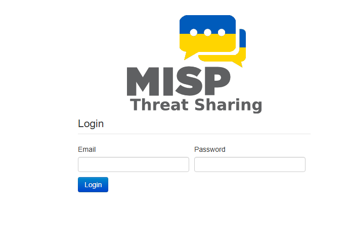

# MISP Threat Intelligence Labs

🧪 **MISP Installation Guide using Docker (Ubuntu 20.04)**

This chapter explains how to deploy MISP (Malware Information Sharing Platform) using Docker on Ubuntu 20.04. This environment serves as the foundation for conducting threat intelligence labs.

## ✅ Prerequisites

- Ubuntu Server 20.04 LTS
- Internet connectivity
- User with sudo privileges

## 🔧 1. Install Docker

```bash
for pkg in docker.io docker-doc docker-compose podman-docker containerd runc; do sudo apt remove $pkg; done
sudo apt install ca-certificates curl gnupg

sudo install -m 0755 -d /etc/apt/keyrings
curl -fsSL https://download.docker.com/linux/ubuntu/gpg | sudo gpg --dearmor -o /etc/apt/keyrings/docker.gpg
sudo chmod a+r /etc/apt/keyrings/docker.gpg
```

Add the official repository:

```bash
echo "deb [arch=$(dpkg --print-architecture) signed-by=/etc/apt/keyrings/docker.gpg] https://download.docker.com/linux/ubuntu $(. /etc/os-release && echo "$VERSION_CODENAME") stable" | sudo tee /etc/apt/sources.list.d/docker.list > /dev/null

sudo apt update
```

Install Docker and plugins:

```bash
sudo apt install docker-ce docker-ce-cli containerd.io docker-buildx-plugin docker-compose-plugin
```

Start and enable Docker:

```bash
sudo systemctl start docker
sudo systemctl enable docker
```

Verify the installation:

```bash
sudo docker run hello-world
```

## 📦 2. Clone the MISP Docker repository

```bash
git clone https://github.com/MISP/misp-docker
cd misp-docker
```

## ⚙️ 3. Prepare the `.env` file

```bash
cp template.env .env
vim .env  # or use nano if you prefer
```

Denife following variable, add the private ip:

- `BASE_URL`

## 🛠 4. Build the containers

```bash
sudo docker compose build
```


Once the build finishes successfully, run:

```bash
sudo docker compose up -d
```

Access your MISP instance from your browser:

```
https://<YOUR-IP>:8080
```

## 🔐 Default Credentials

Username: admin@admin.test

Password: admin

---


