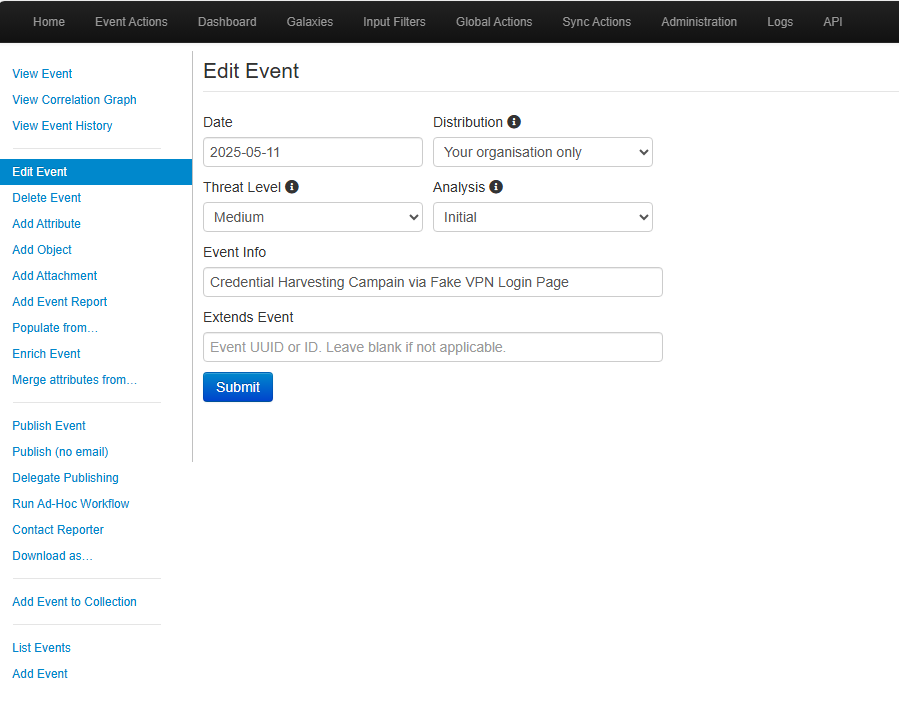
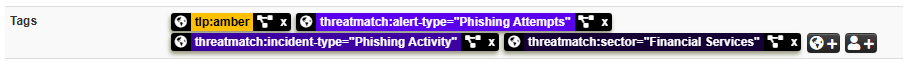
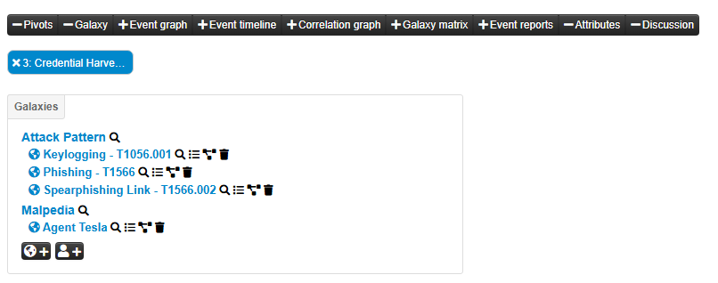
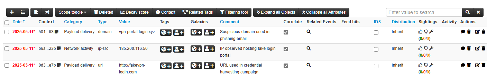

# 🧠 How to Create MISP Events and Add Threat Intelligence

This hands-on cybersecurity lab simulates a credential harvesting phishing campaign using the Malware Information Sharing Platform (MISP). You'll learn how to create a threat event, enrich it with Indicators of Compromise (IOCs), classify it using taxonomies and galaxy clusters, and structure the data for analysis and sharing.

🔒 The lab mimics a realistic scenario where adversaries deploy a fake VPN portal to steal credentials. It provides a complete walkthrough to help analysts practice cyber threat intelligence techniques step by step.

---

## 📌 Scenario

A phishing campaign is attempting to steal user credentials using a fake VPN login page. The attack targets employees of a financial organization. The campaign includes:
- A fake login page hosted on a suspicious domain
- A known phishing-related IP address
- A malicious URL impersonating the company’s VPN portal

---

## ✅ Lab Checklist

- ✅ Creating the Event
- ✅ Adding Tags (Taxonomies)
- ✅ Adding Galaxies (ATT&CK Mapping)
- ✅ Adding Attributes (IOCs)
- ✅ Adding File Object (Malicious Attachment)

---

## 1. Creating the Event

Go to: **Event Actions > Add Event**

Use the following metadata:
- **Date**: Current date
- **Distribution**: Your organisation only
- **Threat Level**: Medium
- **Analysis**: Initial
- **Event Info**: Credential Harvesting Campaign via Fake VPN Login Page

📷 *Screenshot Example: 

---

## 2. Adding Tags (Taxonomies)

Tags help classify the event for filtering and sharing.

Steps:
- Go to: **Administration > Taxonomies**
- Enable relevant taxonomies like:
  - Traffic Light Protocol (TLP)
  - ThreatMatch

❗ After enabling a taxonomy, you must also activate the specific tags you plan to use.

Example Tags:
- `tlp:amber`
- `threatmatch:alert-type="Phishing Attempts"`
- `threatmatch:incident-type="Phishing Activity"`
- `threatmatch:sector="Financial Services"`

📷 *Screenshot Examples:

---

## 3. Adding Galaxies (ATT&CK Mapping)

Use MITRE ATT&CK galaxies to classify the tactics and techniques used in the phishing campaign.

Steps:
- Go to the Event Page
- Scroll to the Galaxies section
- Click ➕ Add and search for MITRE ATT&CK-related clusters

Recommended Clusters:
- `T1056.001 - Keylogging`
- `T1566 - Phishing`
- `T1566.002 - Spearphishing Link`

🧠 **Extra Galaxy Mapping (Malpedia)**  
You can also add malware indicators such as:
- **Agent Tesla** (Malpedia cluster)

📷 *Screenshot Example: 

---

## 4. Adding Attributes (IOCs)

Steps:
- Go to your event page
- Click **Add Attribute**

Examples:

**Malicious URL**
- Category: `Payload delivery`
- Type: `url`
- Value: `http://fakevpn-login[.]com`
- Comment: URL used in credential harvesting campaign

**Phishing IP**
- Category: `Network activity`
- Type: `ip-src`
- Value: `185.200.116.50`
- Comment: IP observed hosting fake login portal

**Fake Domain**
- Category: `Payload delivery`
- Type: `domain`
- Value: `vpn-portal-login[.]xyz`
- Comment: Suspicious domain used in phishing email

---

## 5. Adding File Object (Malicious Attachment)

Simulate a fake VPN installer by grouping file indicators.

Steps:
- Go to Event Page > **Add Object**
- Select: `file` > `file`

IOC Data:

| Field         | Value                                          | Category             | Comment                                   |
|---------------|------------------------------------------------|----------------------|-------------------------------------------|
| filename      | vpn_setup.exe                                  | Payload delivery     | Name of the impersonated installer        |
| md5           | 2d6d3bfc9c24ac96b640b44bff6af2a5               | Payload delivery     |                                           |
| sha1          | b0fca6de0ae29a1a52dfb2e44ccf0d5ffdb6           | Payload delivery     |                                           |
| sha256        | 95c3a5ee8b3aa77a593efcb2c328a1a997...          | Payload delivery     |                                           |
| imphash       | e52cbd4aa510a8e79b3c6db85da053e3               | Payload delivery     | Used for malware correlation              |
| mimetype      | application/x-dosexec                          | Artifacts dropped    | Windows executable MIME type              |
| size-in-bytes | 431872                                         | Other                | 421 KB payload                            |

📷 *Screenshot Example:

---

## 🔚 Wrapping Up the Lab

Your MISP Event should now include:
- A clear scenario with metadata
- Classification tags using TLP and ThreatMatch
- ATT&CK and Malpedia galaxies
- IOCs: URL, IP, domain
- Malware file object

This lab helps simulate a real-world intelligence cycle using MISP for threat enrichment and sharing.
