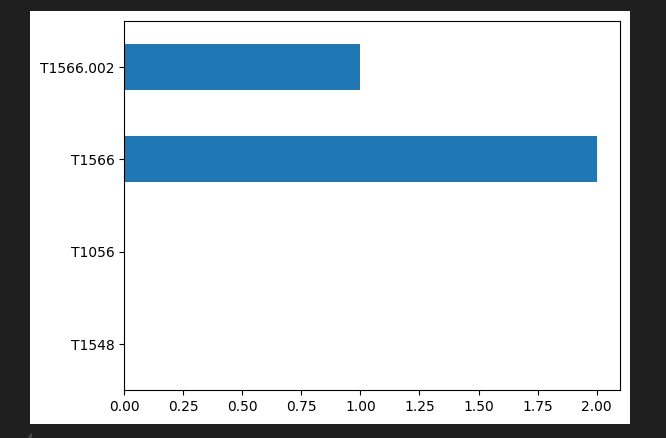

# MISP Threat Intelligence API Automation Lab

This lab demonstrates how to automate interactions with the MISP API using Python. The goal is to retrieve and visualize threat intelligence data such as statistics, attributes, tags, and TTPs (Tactics, Techniques, and Procedures). This enhances efficiency and consistency in threat intelligence operations.

## 📑 Table of Contents
- [Introduction](#introduction)
- [Retrieve User Statistics](#retrieve-user-statistics)
- [Retrieve Tag Usage Statistics](#retrieve-tag-usage-statistics)
- [Retrieve Attribute Type Counts](#retrieve-attribute-type-counts)
- [General Instance Summary](#general-instance-summary)
- [Search for an IOC via API](#search-for-an-ioc-via-api)
- [Extract and Count MITRE ATT&CK TTPs](#extract-and-count-mitre-attack-ttps)
- [Visualize TTPs with Matplotlib](#visualize-ttps-with-matplotlib)
- [Conclusion](#conclusion)

## Introduction
MISP (Malware Information Sharing Platform) provides a powerful API that allows automation of routine threat intelligence tasks. This lab walks through practical use cases where Python scripts interact with MISP to retrieve insights and visualize data, replicating real-world CTI workflows.

## Retrieve User Statistics
This script retrieves statistics about users, events, and attributes in the current MISP instance. Useful for understanding platform usage.

```python
response = misp.users_statistics()
pprint(response)
```

Example Output:
```bash
{'stats': {'user_count': '2', 'event_count': '3', 'attribute_count': '14', ... }}
```

## Retrieve Tag Usage Statistics
Get statistics on how tags are used within your instance. Helps understand classification trends.

```python
tag_stats = misp.tags_statistics()
pprint(tag_stats)
```

Example Output:
```bash
{'tags': {'tlp:amber': '1', 'threatmatch:incident-type="Phishing Activity"': '1', ... }}
```

## Retrieve Attribute Type Counts
Fetch counts of attribute types (IP, domain, URL, hashes, etc.) in the instance.

```python
attr_stats = misp.attributes_statistics()
pprint(attr_stats)
```

Example Output:
```bash
{'domain': '2', 'ip-src': '2', 'url': '2', 'md5': '1', 'sha1': '1', ... }
```

## General Instance Summary
Print basic statistics in a simplified format for quick overview.

```python
def general_stats():
    res = misp.users_statistics()
    print(f"Total user: {res['stats']['user_count']}")
    print(f"Total event: {res['stats']['event_count']}")
    print(f"Total attributes: {res['stats']['attribute_count']}")
general_stats()
```

Example Output:
```bash
Total user: 2
Total event: 3
Total attributes: 14
```

## Search for an IOC via API
Search for a specific IOC (e.g., domain, IP) and display its details.

```python
IOC = "malicious-domain.com"
response = misp.search(value=IOC)
pprint(response)
```

Example Output (simplified):
```bash
[{'Event': {'Attribute': [{'category': 'Payload delivery', 'type': 'domain', 'value': 'malicious-domain.com', ... }]}}]
```

## Extract and Count MITRE ATT&CK TTPs
Loop through events and count the occurrence of specific MITRE ATT&CK techniques.

```python
all = misp.search(controller="events")
ttps = {"T1548": 0, "T1056": 0, "T1566": 0, "T1566.002": 0}
for i in all:
    galaxies = i['Event']['Galaxy']
    for j in galaxies:
        if j['type'] == 'mitre-attack-pattern':
            for k in j['GalaxyCluster']:
                ttp = k['meta']['external_id'][0]
                if ttp in ttps:
                    ttps[ttp] += 1
pprint(ttps)
```

Example Output:
```bash
{'T1056': 0, 'T1548': 0, 'T1566': 2, 'T1566.002': 1}
```

## Visualize TTPs with Matplotlib
Generate a horizontal bar chart of TTP counts.

```python
import pandas as pd
ttps_data = pd.Series(data=ttps, index=list(ttps.keys()))
ttps_data.plot.barh()
```

Example Visualization:


## Conclusion
This lab showcased how to automate key tasks in MISP using its API and Python scripts. By retrieving statistics, searching for IOCs, and visualizing TTPs, analysts can streamline threat intelligence workflows. These scripts can be expanded for integrations with SIEMs, dashboards, or enrichment pipelines.

---
*Note: All data used in this lab is for educational purposes only.*
